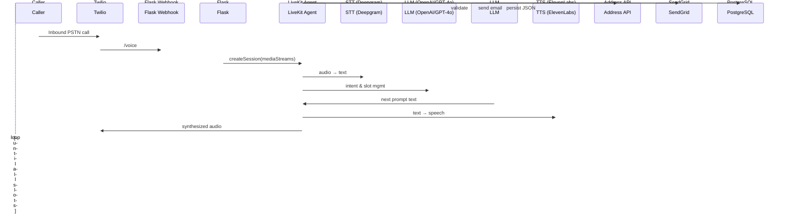

# Voice Appointment Scheduling Agent

## 1. Product Overview

A cloud-hosted voice agent reachable via a public phone number that triages new or returning patients, captures all information required to schedule an appointment, and emails the caller a confirmation summary. The agent replaces front-desk intake calls and operates 24/7.

## 2. Goals & Success Criteria

- **Completion Rate ≥ 90 %** of calls reach "fully captured" state.
- **Average Call Duration ≤ 4 min** for successful captures.
- **STT Accuracy ≥ 95 %** on required fields.
- System uptime **≥ 99.9 %** (24 × 7).
- HIPAA-aligned data handling.

## 3. User Personas

| Persona          | Goal                               | Technical Constraints                              |
| ---------------- | ---------------------------------- | -------------------------------------------------- |
| Patient Caller   | Book appointment quickly by phone. | Varies in accent, background noise, phone quality. |
| Operations Staff | Receive structured intake data.    | Needs CSV / EHR import and email notifications.    |
| Engineer (You)   | Maintain & extend system.          | Python-centric stack, CI/CD, logging.              |

## 4. High-Level Call Flow

1. **Inbound Call** via Twilio Voice → webhook (Flask)
2. **Voice Agent Session** created in LiveKit Voice Agent (or Pipecat)
3. **Greeting & Consent**
4. **Field Collection Loop**: iterates over required slots
   1. Name & DOB
   2. Insurance payer name & ID
   3. Referral physician
   4. Chief complaint
   5. Address → validate via external API; re-prompt on invalid
   6. Contact phone & email
5. **Offer Appointments** (mock provider/time list)
6. **Confirm & Summarize**
7. **Good-bye**; hang-up
8. **Post-Call Actions**: email confirmation, persist data, metrics.

## 5. Functional Requirements

1. Expose **public DID phone number**.
2. **Collect & validate** all seven data elements before call closure.
3. **Dynamic slot-filling**: agent should skip already provided slots.
4. **Address validation** using USPS or Zip-code API; reprompt on error.
5. **Fallback / Escalation**: after 3 failed attempts → transfer to live agent or voicemail.
6. **Email Confirmation** (SendGrid) to caller + ops alias.
7. **Call Recording & Logs** stored for QA (encrypted at rest).
8. **Analytics Dashboard** (Grafana) for KPIs.

## 6. Non-Functional Requirements

- Latency < 700 ms round-trip (speech ↔ speech).
- Scalable to 50 concurrent calls.
- Resilient to STT errors (confidence threshold & reprompts).
- HIPAA alignment (ePHI encryption, audit logs, BAAs with vendors).

## 7. External Services & SDKs

| Concern             | Provider                           | Python SDK                      | Notes                         |
| ------------------- | ---------------------------------- | ------------------------------- | ----------------------------- |
| Telephony           | Twilio Voice                       | twilio                          | Webhook & media streams       |
| STT                 | Deepgram **or** AssemblyAI         | deepgram-sdk / assemblyai       | Real-time WS mode             |
| TTS                 | ElevenLabs **or** Cartesia         | elevenlabs                      | Instant voice or custom voice |
| Agent Orchestration | LiveKit Voice Agent **or** Pipecat | livekit-agents-client / pipecat | Dialogue pipeline             |
| Address Validation  | USPS, Smarty, or Google Geocoding  | requests                        | Needs API key                 |
| Email               | SendGrid                           | sendgrid                        | Secure email + templates      |
| Storage             | PostgreSQL + SQLAlchemy            | psycopg2-binary                 | PII encrypted columns         |
| Hosting             | AWS ECS / Fargate                  | ‑                               | IaC via Terraform             |

## 8. Technical Architecture



### Component Breakdown

1. **Twilio Voice Webhook** (Flask): bridges PSTN with media streams to LiveKit.
2. **LiveKit/Pipecat Pipeline**: real-time bidirectional audio, STT, LLM prompt orchestration, TTS.
3. **Dialogue Manager**: slot list & state machine (Python class).
4. **Validation Layer**: address, phone, DOB formats.
5. **Persistence Layer**: SQLAlchemy models → PostgreSQL.
6. **Notification Service**: SendGrid email worker (Celery).
7. **Monitoring**: Prometheus metrics exporter, Grafana dashboards, Sentry for errors.

## 9. Data Model (simplified)

```sql
PatientIntake (
  id UUID PK,
  call_sid TEXT UNIQUE,
  full_name TEXT,
  dob DATE,
  insurance_payer TEXT,
  insurance_id TEXT,
  referral_physician TEXT,
  chief_complaint TEXT,
  address_line1 TEXT,
  address_line2 TEXT,
  city TEXT,
  state CHAR(2),
  zip TEXT,
  phone TEXT,
  email TEXT NULL,
  provider_offered TEXT,
  appt_datetime TIMESTAMP,
  created_at TIMESTAMP DEFAULT now()
)
```

## 10. Detailed Call Handling Logic

1. **On call start** create record with `call_sid`.
2. **For each slot**:
   - Check cache → if empty, prompt.
   - After STT result, run regex/validation.
   - If low confidence or invalid, reprompt.
   - Write to DB.
3. **Offer Appointments**: choose first available mock slot list (config JSON).
4. **Confirmation**: repeat all collected data, ask for "Yes".
5. **On Success** → send email & close session.
6. **On Escalation** → handoff to live ops number using Twilio `Dial`.

## 11. Security & Compliance

- All env creds in AWS Secrets Manager.
- TLS 1.2+ for all vendor APIs.
- At-rest encryption (AES-256) on DB columns with PII/ePHI.
- Signed BAAs with Twilio, Deepgram/AssemblyAI, ElevenLabs, AWS.
- Call recordings encrypted & purged after 30 days.

## 12. Deployment Plan

1. **Infrastructure**: Terraform module standing up VPC, Fargate service, RDS Postgres, ALB.
2. **CI/CD**: GitHub Actions → pytest → Docker build → ECR → ECS deploy.
3. **Observability**: CloudWatch logs, Prometheus sidecar, Sentry.

## 13. Environment Configuration

| Variable                 | Example               |
| ------------------------ | --------------------- |
| TWILIO_ACCOUNT_SID       | AC•••                 |
| TWILIO_AUTH_TOKEN        | •••                   |
| TWILIO_PHONE_NUMBER      | +1•••                 |
| LIVEKIT_URL              | wss://agent.myorg.com |
| LIVEKIT_API_KEY / SECRET | •••                   |
| DEEPGRAM_API_KEY         | dg•••                 |
| ELEVENLABS_API_KEY       | el-•••                |
| SENDGRID_API_KEY         | sg-•••                |
| ADDRESS_API_KEY          | •••                   |
| DATABASE_URL             | postgresql://•••      |

## 14. Testing Strategy

- **Unit Tests**: dialogue manager, validators.
- **E2E Tests**: Twilio Test Console → mocked audio.
- **Load Test**: 50 concurrent calls using Twilio Tools.
- **Acceptance Test**: real call to staging number, verify email.

## 15. Roll-out & Milestones

| Phase | Deliverable                 | Target |
| ----- | --------------------------- | ------ |
| 0     | Tech spec (this doc)        | Day 0  |
| 1     | MVP: call → collect → email | Week 1 |
| 2     | Address validation, retries | Week 2 |
| 3     | Metrics & dashboards        | Week 3 |
| 4     | Load test + HIPAA audit     | Week 4 |
| 5     | Prod launch (10 providers)  | Week 5 |

## 16. Future Enhancements

- SMS fallback & reminders.
- Calendar integration (Athenahealth, Redox).
- Voice-ID authentication for returning patients.
- Multilingual support (Spanish).

---

**Document Version**: v0.1 — generated 2025-05-11
